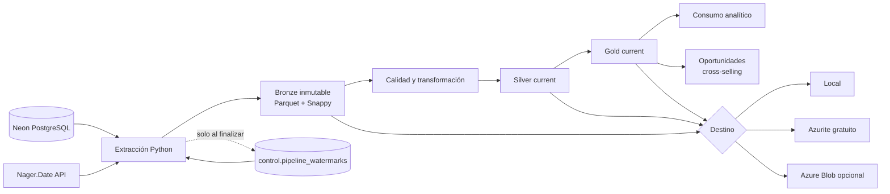

# Arquitectura de la plataforma

## Objetivo

Convertir movimientos comerciales en datasets analíticos y oportunidades de
cross-selling reproducibles, auditables y explicables.

## Flujo end-to-end

El archivo fuente del diagrama está en
[`diagrams/pipeline.mmd`](diagrams/pipeline.mmd).

## Responsabilidades por capa

### Bronze

- Conserva los datos de origen sin aplicar reglas comerciales.
- Añade `_ingested_at`, `_pipeline_run_id`, `_source_system`, `_source_table`,
  `_extract_type` y `_watermark_value`.
- Se guarda por `run_id`, por lo que las cargas son auditables e inmutables.
- Las dimensiones se extraen completas; ventas se extrae incrementalmente.

### Silver

- Valida columnas, claves únicas, claves foráneas y jerarquías.
- Normaliza fechas y valores numéricos.
- Clasifica cada movimiento como `sale`, `return` o `zero_value`.
- Integra atributos de cliente, destinatario, producto, jerarquía y feriado.
- Publica `dim_client`, `dim_recipient`, `dim_product`, `dim_calendar` y
  `fact_sales` bajo la ruta estable `current`.

### Gold

- `sales_summary`: venta por fecha, cliente, producto y categoría.
- `product_pairs`: afinidad entre productos comprados en la misma factura.
- `cross_sell_recommendations`: candidatos ordenados y explicables.
- `customer_360`: actividad y valor acumulado del cliente.

Las reglas consideran únicamente movimientos `sale`. Una recomendación se
elimina si el cliente ya compró ese producto. El score combina confidence, lift
y frecuencia conjunta; no es un modelo opaco ni requiere servicios de ML pagos.

## Persistencia y ciclo de vida

- **Bronze:** histórico por corrida; no se limpia automáticamente.
- **Silver/Gold:** snapshot vigente en `current`, reemplazado atómicamente.
- **Watermark:** estado pequeño y vivo en el esquema `control` de Neon.
- **Full refresh:** inicializa un destino nuevo.
- **Force rebuild:** recalcula Silver/Gold desde Bronze sin duplicar la fuente.

## Operación sin costo

El entorno de desarrollo usa Azurite como emulador de Azure Blob. Terraform
declara la infraestructura real, pero `terraform validate` no crea nada. El
despliegue real permanece opcional y requiere una revisión explícita de costos.
